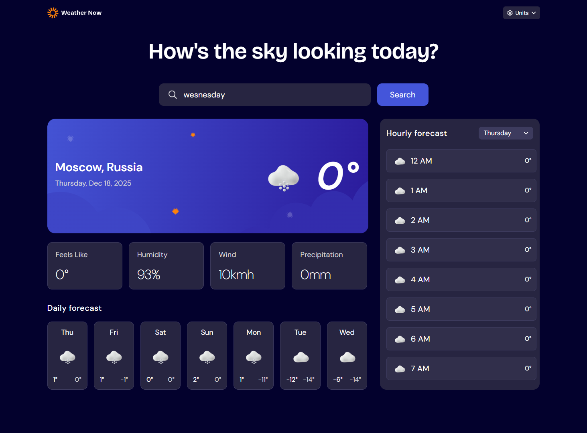

# Frontend Mentor – Weather App Solution

This is a solution to the [Weather app challenge on Frontend Mentor](https://www.frontendmentor.io/challenges/weather-app-K1FhddVm49).  
Frontend Mentor challenges help improve frontend skills by building realistic projects with real-world requirements.

This project is **my first full React application after approximately one month of learning React**.  
I chose this challenge to practice core React concepts, application state management, data fetching, and building responsive interfaces using Tailwind CSS.

---

## Table of contents

- [Overview](#overview)
  - [The challenge](#the-challenge)
  - [Screenshot](#screenshot)
  - [Links](#links)
- [My process](#my-process)
  - [Built with](#built-with)
  - [What I learned](#what-i-learned)
  - [Continued development](#continued-development)
  - [Useful resources](#useful-resources)
- [Author](#author)

---

## Overview

### The challenge

Users should be able to:

- Search for weather information by entering a location
- View current weather conditions (temperature, icon, city, country)
- See additional metrics such as:
  - “Feels like” temperature
  - Humidity
  - Wind speed
  - Precipitation
- Browse a 7-day weather forecast with daily min/max temperatures
- View an hourly forecast grouped by day
- Switch between days in the hourly forecast via a selector
- Toggle between **Metric** and **Imperial** units
- Independently control units for:
  - Temperature (°C / °F)
  - Wind speed (km/h / mph)
  - Precipitation (mm / in)
- Experience an optimized layout for mobile and desktop screens
- See hover and focus states for all interactive elements

---

### Screenshot



> Screenshot of the final solution (mobile-first, responsive layout).

---

### Links

- **Solution URL:** [Frontend Mentor Solution](https://www.frontendmentor.io/challenges/weather-app-K1FhddVm49)]
- **Live Site URL:** [Weather App](https://1krasyuk.github.io/weather-app-react/)

---

## My process

### Built with

- Semantic HTML5
- Tailwind CSS **v4**
- Mobile-first workflow
- Flexbox & CSS Grid
- [React](https://react.dev/) **v19**
- [Vite](https://vitejs.dev/)
- [React Router](https://reactrouter.com/) **v7**
- Context API for global state management
- Open-Meteo API (no API key required)

---

### What I learned

This project significantly strengthened my understanding of **core React concepts and real-world application structure**.

Key takeaways:

- Designing a **global units system** using React Context with persistence via `localStorage`
- Clean separation of concerns between:
  - UI components
  - Context providers
  - Utility and conversion functions
- Avoiding common React pitfalls such as:
  - Conditional hook calls
  - Controlled vs uncontrolled input issues
  - Incorrect `useEffect` dependencies
- Grouping and transforming API data (hourly forecast grouped by day)
- Building a scalable **mobile-first responsive layout** using Tailwind CSS
- Deploying a Vite + React application to **GitHub Pages** with a correct base path configuration

Example of weather data fetching using two APIs (Geocoding API and Open Meteo API):

```js
const [weather, setWeather] = useState({});
const [searchParams, _] = useSearchParams("");
const searchCity = searchParams.get("city") || "Berlin";

useEffect(() => {
  const fetchWeatherData = async () => {
    try {
      const geoResponse = await fetch(
        `https://geocoding-api.open-meteo.com/v1/search?name=${searchCity}&count=10&language=en&format=json`
      );
      if (!geoResponse.ok)
        throw new Error("Error while fetching Geocoding API");

      const geoData = await geoResponse.json();
      const location = geoData.results?.[0];
      if (!location)
        throw new Error("City not found, check if your input is right");

      const { name: city, country, latitude, longitude } = location;

      const meteoRes = await fetch(
        `https://api.open-meteo.com/v1/forecast?latitude=${latitude}&longitude=${longitude}&daily=temperature_2m_max,temperature_2m_min,weather_code&hourly=temperature_2m,weather_code&current=temperature_2m,precipitation,wind_speed_10m,apparent_temperature,relative_humidity_2m,weather_code&timezone=auto`
      );
      if (!meteoRes.ok) throw new Error("Error while fetching Open Meteo API");

      const meteoData = await meteoRes.json();

      setWeather({ city, country, ...meteoData });
      console.log("✅ MeteoData:", meteoData);
    } catch (err) {
      console.error(err);
    } finally {
      console.log("Fetching complete");
    }
  };

  fetchWeatherData();
}, [searchCity]);
```

Example of unit conversion abstraction:

```js
export function convertTemperature(value, unit) {
  if (unit === "f") return Math.round((value * 9) / 5 + 32);
  return Math.round(value);
}
```

## Author

- Frontend Mentor - [@1krasyuk](https://www.frontendmentor.io/profile/1krasyuk)
- GitHub - [1krasyuk](https://github.com/1krasyuk)
- Twitter (X) - [@1krasyuk](https://x.com/1krasyuk)
